# Kunafa Dashboard Vue

[](https://vuejs.org/)
[](https://vitejs.dev/)

A feature-rich Vue.js 3 dashboard template with multi-language support and full RTL/LTR bidirectional layout capabilities.

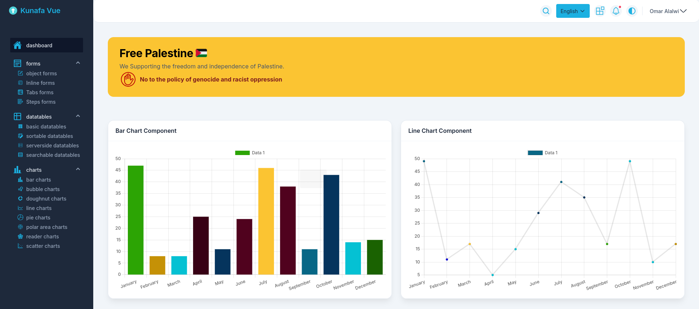

## ✨ Features

- 🌐 Internationalization (i18n) with Vue I18n
- 🔌 Ready Integrated with API endpoints via [DummyJson](https://dummyjson.com/)
- ↔️ Bidirectional layout support (RTL/LTR)
- 📊 8+ Chart types powered by Chart.js
- 📋 Advanced Data Tables with sorting/filtering
- 🖋️ Dynamic Forms with multiple layouts:
  - Inline forms
  - Tabbed forms
  - Stepped forms
  - Object-based forms
- 🎨 Modern UI built with Tailwind CSS
- 🗃️ State management via Pinia
- ⚡ Vite-powered development
- 🧩 Component-based architecture

## 🛠️ Technologies

**Core Framework**
- Vue.js 3 (Composition API)
- Vue Router 4
- Pinia (State Management)

**API Integration**
- [DummyJSON](https://dummyjson.com/) (Mock REST API)
- Axios (HTTP Client)

**Styling & UI**
- Tailwind CSS 3
- PostCSS RTL
- Iconify (Icon Library)

**Data Visualization**
- Chart.js 3
- vue-chart-3

**Forms & Tables**
- Vueform Builder
- vue3-easy-data-table

**Utilities**
- Axios (HTTP Client)
- Vue I18n (Internationalization)
- VueUse (Composition Utilities)
- Moment.js (Date handling)
-  uses data from [Chart.js](https://www.chartjs.org/) .
- user icons from [Iconify](https://iconify.design/) .

---

## 📸 Screenshots

| Light Mode (LTR) | Dark Mode (RTL) |
|-------------------|------------------|
|  | 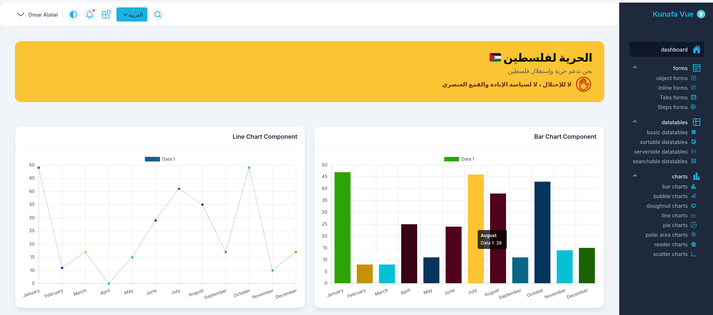 |

<div style="max-height: 800px; overflow-y: auto; border: 1px solid #ddd; padding: 10px; width: 600px;">

Forms
---
 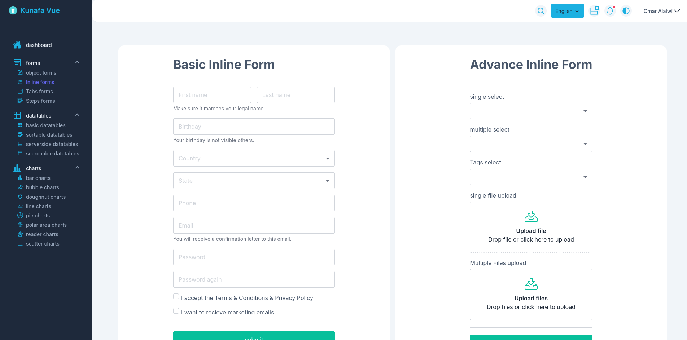
  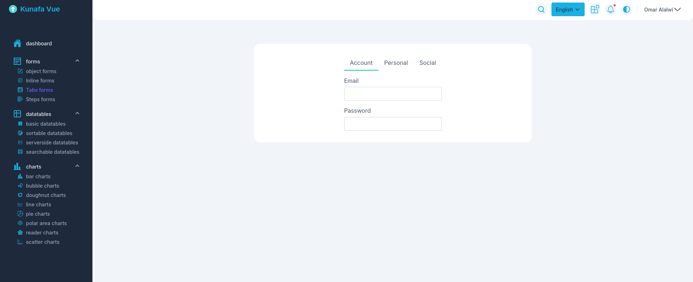
  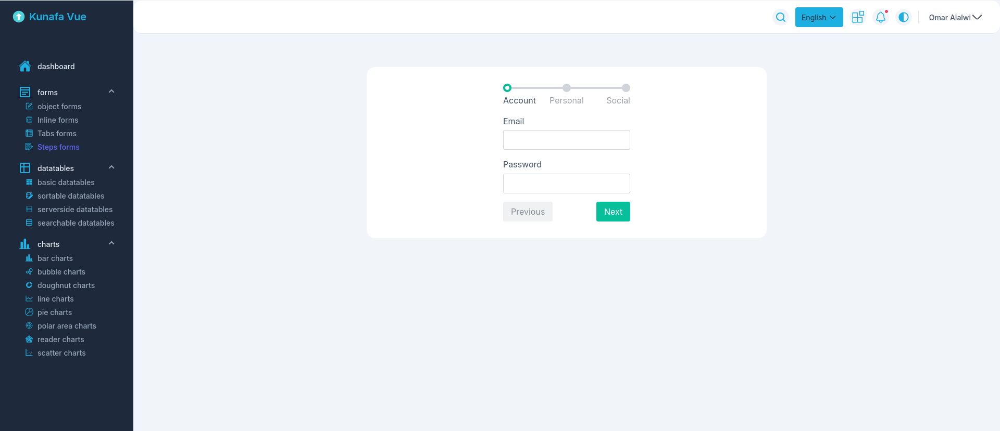
  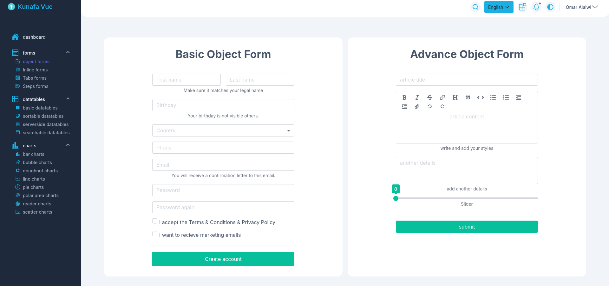

Charts
---

  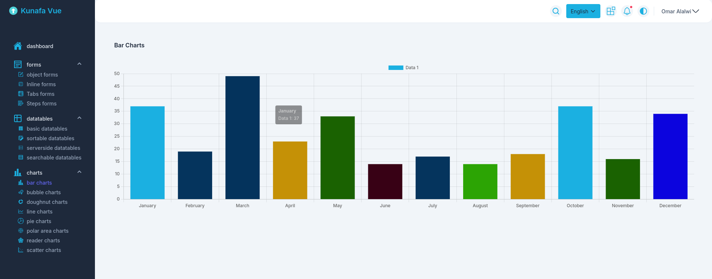
  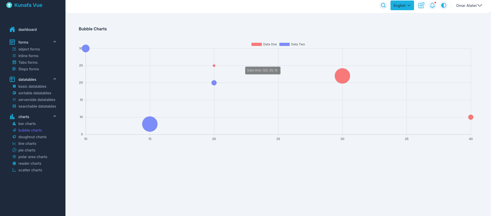
  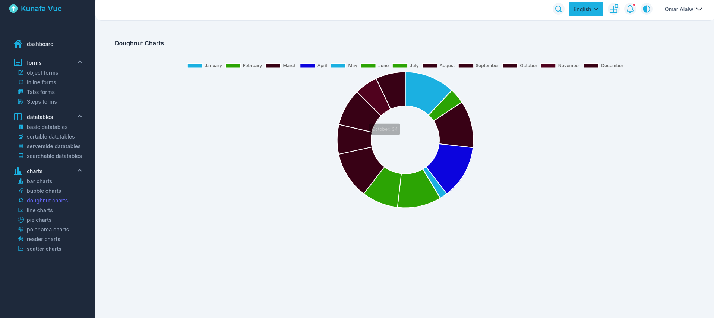
  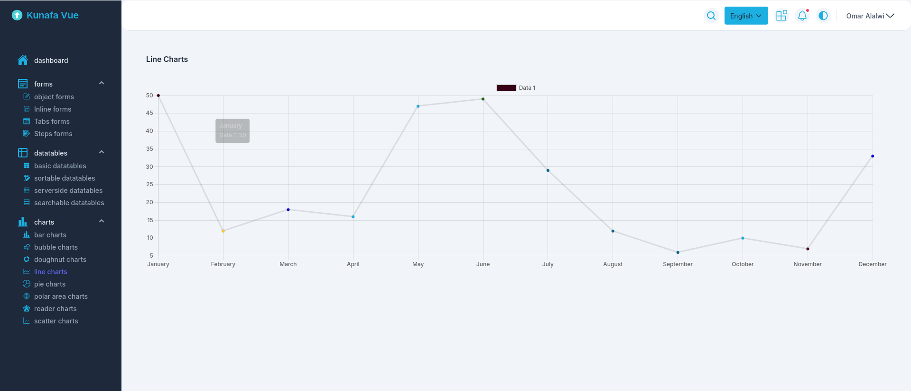
  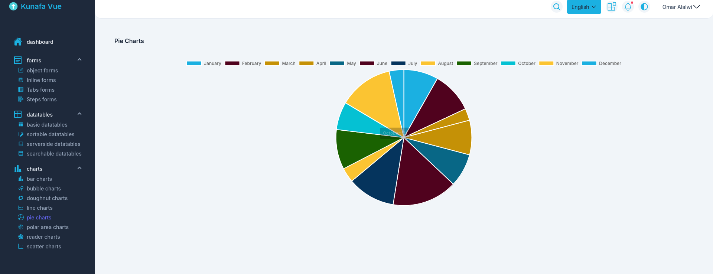
  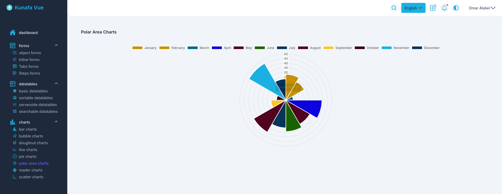
  
  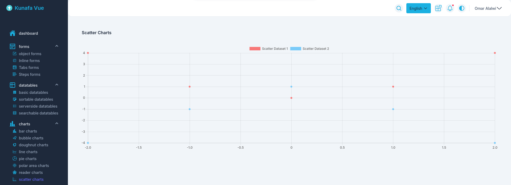

Datatables
---
  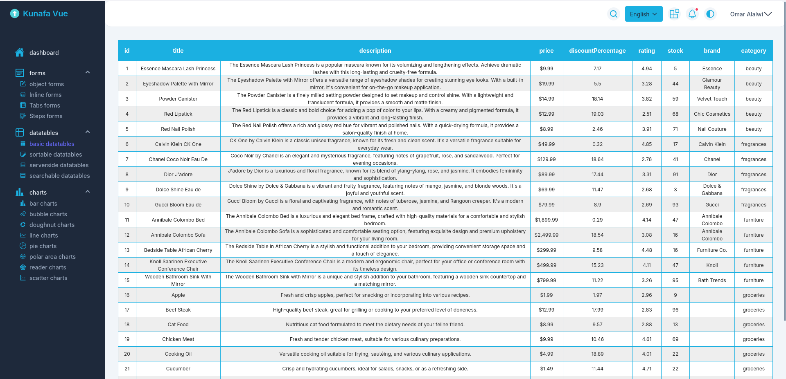
  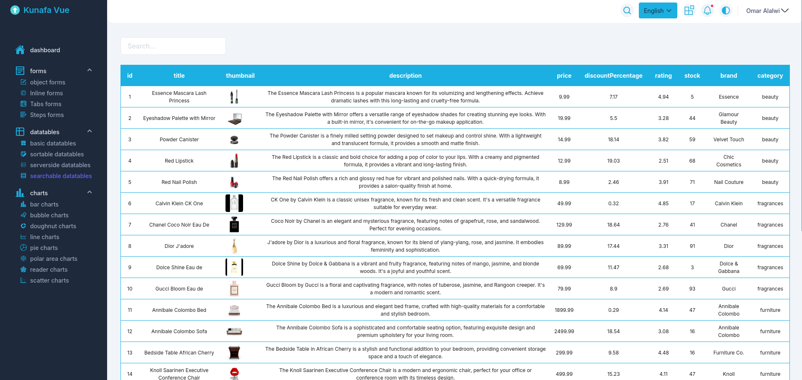
  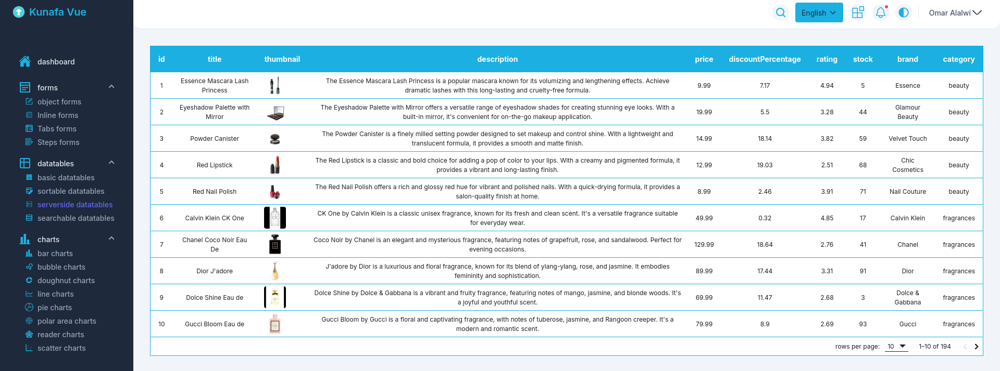
  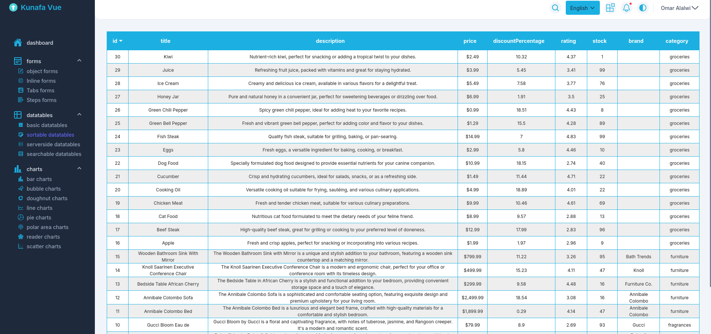

</div>

---

## 🚀 Quick Start

### Prerequisites
- Node.js v20.x or higher
- npm, pnpm, or yarn

### Installation
1. Clone the repository:
```bash
git clone git@github.com:kunafaPlus/kunafa-dashboard-vue.git
cd kunafa-dashboard-vue
```

2. Install dependencies:
```bash
npm install   # or pnpm install / yarn install
```

3. Start development server:
```bash
npm run dev
```

4. Build for production:
```bash
npm run build
```

## TODO

Here are planned enhancements and fixes for the Kunafa Dashboard Vue project:

- Replace all SVG icons with **Iconify** icons.
- Translate the entire application into both **Arabic** and **English**.
- Convert all CSS files to **SASS** for better maintainability and customization.
- Fix images and certain HTML properties in **DataTables** components.
- Implement proper **pagination** for server-side DataTables.
- Integrate the **vue-advanced-chat** package for real-time chat functionality.  
  ([vue-advanced-chat](https://www.npmjs.com/package/vue-advanced-chat))
- Add a **Kanban dashboard** for task management using the following open-source library:  
  ([kanban-task-management](https://github.com/UnTalPeluca/kanban-task-management)).

## Dependencies Overview
<details>

<summary> summary about Dependencies </summary>

- **@intlify/unplugin-vue-i18n**: Plugin for integrating vue-i18n with Vite.
- **@vueform/vueform**: Advanced form builder for Vue.js.
- **@vueuse/core**: Collection of essential Vue.js composition utilities.
- **axios**: Promise-based HTTP client for making API requests.
- **chart.js**: Flexible and powerful charting library.
- **chartjs-adapter-moment**: Adapter for integrating Moment.js with Chart.js.
- **flatpickr**: Lightweight and powerful date picker.
- **moment**: JavaScript date library for parsing, validating, manipulating, and formatting dates.
- **pinia**: Intuitive and type-safe state management solution for Vue.js.
- **postcss-rtlcss**: PostCSS plugin for converting LTR styles to RTL.
- **vue**: Core Vue.js library.
- **vue-chart-3**: Vue.js wrapper for Chart.js.
- **vue-flatpickr-component**: Vue component for Flatpickr.
- **vue-i18n**: Internationalization plugin for Vue.js.
- **vue-router**: Routing library for Vue.js.
- **vue3-easy-data-table**: Lightweight and customizable data table component for Vue.js.
- **@iconify/vue**: Icon component for Vue.js.
- **@vitejs/plugin-vue**: Vite plugin for Vue.js support.
- **tailwindcss**: Utility-first CSS framework.
- **vite**: Frontend tooling for modern web projects.

</details>

## 🤝 Contributing
We welcome contributions! Please follow these steps:
1. Fork the project
2. Create your feature branch (`git checkout -b feature/AmazingFeature`)
3. Commit your changes (`git commit -m 'Add some AmazingFeature'`)
4. Push to the branch (`git push origin feature/AmazingFeature`)
5. Open a Pull Request
6. please follow standard in previous work .


## License

Kunafa Dashboard Vue is licensed under the [MIT License](https://opensource.org/licenses/MIT). Feel free to use, modify, and distribute the code as you see fit.

## Community

Join Community in [Telegram Group](https://t.me/+5_Xh_V1p0HkyNDc0).

